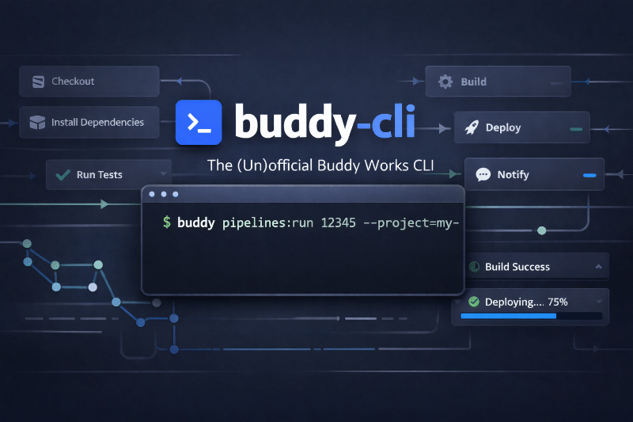

# The (Un)official Buddy Works CLI



A PHP CLI tool for interacting with [Buddy.works](https://buddy.works) CI/CD pipelines.

> **Note:** The official [buddy-works/buddy-cli](https://github.com/buddy-works/buddy-cli) has been abandoned. This project provides a maintained alternative.

## Installation

```bash
composer require jtsternberg/buddy-cli --dev
```

After installation, the `buddy` command is available via `vendor/bin/buddy`.

## Authentication

### Personal Access Token (Recommended)

Set the `BUDDY_TOKEN` environment variable, or run:

```bash
buddy config:set token <your-token>
```

### OAuth Login

```bash
buddy login
```

This opens your browser to authenticate with Buddy and automatically saves your token.

**Setup:** Create an OAuth application at [buddy.works/api/apps](https://app.buddy.works/api/apps) with callback URL `http://127.0.0.1:8085/callback`.

## Configuration

Configuration can be set via environment variables, config files, or command-line flags.

### Environment Variables

```bash
BUDDY_TOKEN=<token>
BUDDY_WORKSPACE=<workspace-name>
BUDDY_PROJECT=<project-name>
```

### Config Files

- User config: `~/.buddy-cli.json`
- Project config: `.buddy-cli.json` (in project root)

```json
{
  "workspace": "my-workspace",
  "project": "my-project"
}
```

### Precedence

1. Command-line flags (`--workspace`, `--project`)
2. Environment variables
3. Project config (`.buddy-cli.json`)
4. User config (`~/.buddy-cli.json`)

## Commands

### Pipelines

```bash
buddy pipelines:list                      # List all pipelines
buddy pipelines:show <id>                 # Show pipeline details
buddy pipelines:show <id> --yaml          # Output as YAML configuration
buddy pipelines:run <id>                  # Run a pipeline
buddy pipelines:run <id> --branch=main    # Run with specific branch
buddy pipelines:run <id> --wait           # Run and wait for completion
buddy pipelines:retry <id>                # Retry last failed execution
buddy pipelines:cancel <id>               # Cancel running execution
buddy pipelines:get <id>                  # Get pipeline config as YAML file
buddy pipelines:create <file>             # Create new pipeline from YAML file
buddy pipelines:update <id> <file>        # Update existing pipeline from YAML
```

### Executions

```bash
buddy executions:list --pipeline=<id>              # List recent executions
buddy executions:show <exec-id> --pipeline=<id>    # Show execution details
buddy executions:show <exec-id> --pipeline=<id> --logs  # Include action logs
buddy executions:failed <exec-id> --pipeline=<id>  # Show failed action details
```

### Projects

```bash
buddy projects:list                       # List projects in workspace
buddy projects:show <name>                # Show project details
```

### Configuration

```bash
buddy config:show                         # Show current configuration
buddy config:set <key> <value>            # Set configuration value
buddy config:clear                        # Clear all configuration
```

## Options

All commands support:

- `--workspace`, `-w` - Workspace name
- `--project`, `-p` - Project name
- `--json` - Output as JSON

## License

MIT
